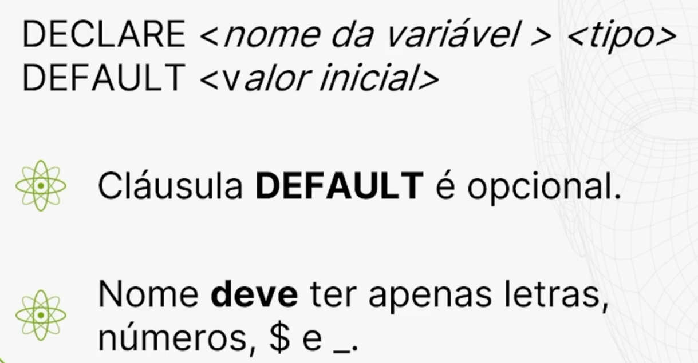

# Declarando a Variáveis através de Store Procedure no MySQL
Variáveis em um programa são espaços de armazenamento na memória do computador onde guardamos valores.

Esses valores podem ser alterados durante a execução do programa. Cada variável é associada a um tipo de dados que determina quais valores ela pode conter, como números inteiros, números de ponto flutuante, caracteres, strings, datas, entre outros.

Dentro de uma **Stored Procedure**, podemos declarar uma variável para diversos fins. A sintaxe da declaração de uma variável é mostrada a seguir:



```sql
DECLARE {nome da variável} {tipo}

DEFAULT {valor inicial}


-- 1. Cláusula DEFAULT é opcional.

-- 2. Nome deve ter apenas letras, números, $ e _.

-- 3. O número de caracteres não pode ultrapassar 255

-- 4. Nome é sensível a maiúsculas e minúsculas

```

Podemos começar uma declaração de variável com DECLARE, seguido pelo nome da variável e seu tipo, com a opção de adicionar a cláusula **DEFAULT** e um valor inicial. A cláusula DEFAULT não é obrigatória; se não for especificada, a variável será inicializada como nula.

É importante notar que o nome da variável deve corresponder ao nome da Stored Procedure e seguir algumas regras: 

* pode conter letras, números, o cifrão ($) e o sublinhado (_). 
* Dentro do programa, o nome deve ser único e respeitar o case sensitive, ou seja, a diferenciação entre maiúsculas e minúsculas é relevante.

* O tamanho do nome da variável pode ser maior do que o da Stored Procedure, podendo ter até 255 caracteres. Ao finalizar a declaração da variável, é necessário incluir um ponto e vírgula.

### Tipos de variáveis
* VARCHAR(N)

* INTEGER

* DECIMAL (p, s)

* DATE TIMESTAMP

Dentro de uma **Stored Procedure**, podemos declarar os mesmos tipos de variáveis usados ao definir campos em tabelas do MySQL. Assim, temos opções como varchar, integer, decimal, date, timestamp, e assim por diante.

Para ilustrar isso no Workbench, podemos fazer exemplos utilizando declarações de variáveis.

### Praticando a declaração de variáveis
Ao acessar a Stored Procedure alo_mundo do lado esquerdo, podemos clicar com o botão direito do mouse e selecionar "**Alter Storage Proceder**" (traduzindo, "Alterar Procedimento de Armazenamento"). No comando exibido, manteremos o nome e adicionaremos uma declaração **DECLARE**.

Por exemplo, podemos escrever `DECLARE texto char(20) DEFAULT` 'Alô mundo!!!';. Ao usar a variável texto, substituímos a constante na execução da Stored Procedure após o SELECT.


```sql
CREATE DEFINER=`root`@`localhost` PROCEDURE `alo_mundo` ()
BEGIN
    DECLARE texto char(20) DEFAULT 'Alô mundo !!!';
    SELECT texto;
END
```
No MySQL Workbench, salvamos clicando no botão "Apply" no canto inferior direito. Na janela seguinte, selecionamos "Finish". Após isso, ao executarmos a Stored Procedure alo_mundo que fizemos na aula passada:

    CALL alo_mundo

Obteremos o mesmo resultado:


    Alô mundo!!!
No entanto, nesta versão, estamos introduzindo o uso de variáveis dentro da Stored Procedure.

### Outro exemplo
Criaremos outra Stored Procedure que utilizará várias variáveis de tipos diferentes. Por exemplo, vamos considerar variáveis relacionadas a um novo aluguel. Para isso, no **MySQL Workbench** clicamos em StoredProcedure do lado esquerdo, depois clicamos com o botão direito do mouse e selecionamos "`Create Stored Procedure`". Será exibido um comando padrão que iremos alterar.

Essa nova Stored Procedure será chamada de `tiposDados`, e vamos incluir declarações de variáveis. Por exemplo, declaramos uma variável chamada `vAluguel`, que será do tipo `VARCHAR()` com tamanho `10`, e terá um valor padrão de `10001`. Também teremos outra variável chamada `vCliente`, do tipo `VARCHAR()` com tamanho `10` e valor padrão.

Vamos exemplificar com o cliente de ID 1002. Introduziremos uma nova variável chamada vHospedagem, do tipo VARCHAR() com 10 caracteres, tendo como valor padrão o código 8635.

Por enquanto, temos:

```sql
CREATE PROCEDURE tiposDados ()
BEGIN
  DECLARE vAluguel VARCHAR(10) DEFAULT 10001;
  DECLARE vCliente VARCHAR(10) DEFAULT 1002;
  DECLARE vHospedagem VARCHAR(10) DEFAULT 8635;
END
```

Além disso, vamos definir a variável vDataInicio como do tipo DATE para representar a data de início, com o padrão sendo 2023/03/01. Podemos replicar essa linha para declarar a variável vDataFinal, que seria o dia 5 de março. A última variável necessária para manipular o registro de aluguel será vPrecoTotal, do tipo DECIMAL(10,2), com o padrão de 550.23.

```sql
CREATE PROCEDURE tiposDados ()
BEGIN
  DECLARE vAluguel VARCHAR(10) DEFAULT 10001;
  DECLARE vCliente VARCHAR(10) DEFAULT 1002;
  DECLARE vHospedagem VARCHAR(10) DEFAULT 8635;
  DECLARE vDataInicio DATE DEFAULT '2023-03-01';
  DECLARE vDataFinal DATE DEFAULT '2023-03-05';
  DECLARE vPrecoTotal DECIMAL(10,2) DEFAULT 550.23;
END
```

Para visualizarmos o resultado final, utilizaremos a seguinte consulta: 

```sql
CREATE PROCEDURE tiposDados ()
BEGIN
  DECLARE vAluguel VARCHAR(10) DEFAULT 10001;
  DECLARE vCliente VARCHAR(10) DEFAULT 1002;
  DECLARE vHospedagem VARCHAR(10) DEFAULT 8635;
  DECLARE vDataInicio DATE DEFAULT '2023-03-01';
  DECLARE vDataFinal DATE DEFAULT '2023-03-05';
  DECLARE vPrecoTotal DECIMAL(10,2) DEFAULT 550.23;
  SELECT vAluguel, vCliente, vHospedagem, vDataInicio, vDataFinal, vPrecoTotal;
END
```
A nossa Stored Procedure ficou assim. Agora podemos aplicá-la clicando em "Apply" duas vezes e chamar essa rotina através de CALL tiposDados. Isso na nossa aba dos comandos da aula passada.


    CALL tiposDados

Ao executar, percebemos que há uma linha com todos os valores, como os dados de entrada de um aluguel.

    vAluguel	vCliente	vHospedagem	vDataInicio	vDataFinal	vPrecoTotal
    10001	      1002	        8635	2023-03-01	2023-03-05	550.23

### Aprimorando a Stored Procedure
Vamos aprimorar ainda mais criando outra Stored Procedure que forneça a data e hora atual do computador. Para fazer isso, clicamos em "StoredProcedure" e selecionamos a opção "`Create Stored Procedure`".

Essa nova Stored Procedure nos dará a dataHora atuais, portanto, esse será o nome. Por exemplo, podemos usar o valor localtimestamp() para obter essa informação do computador. Declaramos uma variável chamada ts, do tipo DATETIME, e definir o valor padrão como localtimestamp().

É importante notar que a variável ts é inicializada com o resultado de uma função localtimestamp(), não sendo necessário atribuir um valor diretamente a ela. Podemos implementar isso como uma função. Executamos SELECT ts:

```sql
CREATE PROCEDURE `dataHora` ()
BEGIN
    DECLARE ts DATETIME DEFAULT localtimestamp();
    SELECT ts;
END
```

Em seguida, clicamos em "Apply" duas vezes e depois "Finish". Em seguida, rodamos o CALL dataHora.

    CALL dataHora;

Ao executar isso, será possível ver a data e hora no momento em que este vídeo está sendo gravado.

    ts
    2024-02-27 03:01:22


## Question - Utilização de variáveis no MySQL

Considere a procedure desenvolvida:

```SQL
CREATE DEFINER=`root`@`localhost` PROCEDURE `novoAluguel_21`()
BEGIN
    DECLARE vAluguel VARCHAR(10) DEFAULT 10001;
    DECLARE vCliente VARCHAR(10) DEFAULT 1002;
    DECLARE vHospedagem VARCHAR(10) DEFAULT 8635;
    DECLARE vDataInicio DATE DEFAULT '2023-03-01';
    DECLARE vDataFinal DATE DEFAULT '2023-03-05';
    DECLARE vPrecoTotal DECIMAL(10,2) DEFAULT 550.23;
    SELECT vAluguel, vCliente, vHospedagem, vDataInicio, 
    vDataFinal, vPrecoTotal;
END

```
A compreensão e o uso eficaz de variáveis em stored procedures são essenciais para otimizar a performance em bancos de dados MySQL. Elas podem ser declaradas e empregadas para tarefas específicas: armazenar valores temporários, manipular dados e controlar a lógica de execução. Durante nossa jornada, exploramos exemplos práticos e um deles incluiu a ilustração da declaração de uma variável, com definição de tipo de dado, valor inicial padrão e sensibilidade ao caso das letras.

Baseando-se nessas informações, qual das seguintes afirmações é correta sobre a declaração de variáveis em stored procedures no MySQL? Escolha uma alternativa.

Selecione uma alternativa

- ( ) Stored procedures no MySQL não permitem a declaração de variáveis; elas devem ser implementadas fora da procedure.


- ( ) As variáveis em stored procedures não podem ser inicializadas com um valor padrão; elas sempre começam com NULL.


- (X) As variáveis são sensíveis ao caso, e seu nome deve ser consistentemente utilizado com a mesma capitalização.
>A sensibilidade ao caso é uma característica importante na declaração e utilização de variáveis em stored procedures no MySQL, como ilustrado no exemplo. Isso significa que a capitalização das letras no nome da variável deve ser mantida consistente ao longo do uso.


- ( ) Uma variável declarada em uma stored procedure pode ter um nome com até 500 caracteres.


- ( ) O nome da variável pode conter qualquer caractere, incluindo espaços e caracteres especiais.
