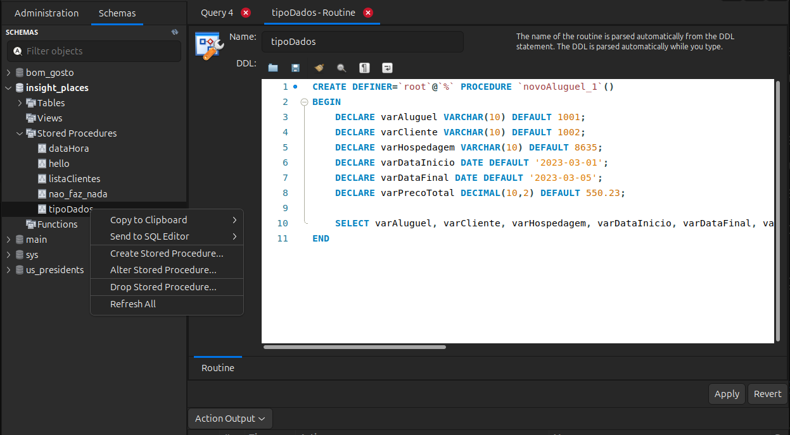

# Manipulando Dados - Inclusão de Aluguéis
Para registrar nosso avanço, cada vídeo, cada atualização na procedure, será armazenada em uma procedure distinta. Assim, ao final, seu banco de dados terá uma lista de procedures que reflete cada aprimoramento feito em cada vídeo.

Durante a apresentação dos próximos vídeos, podemos intercalar melhorias das procedures com algum conceito importante, que fará parte da evolução da procedure final. Para que nosso trabalho flua corretamente, vamos criar as procedures diretamente na tela de scripts do MySQL Workbench.

Vamos seguir este procedimento: Do lado esquerdo, dentro da pasta StoredProcedures, temos nossa procedure chamada de tipoDados, criada no vídeo anterior. Clicamos nela com o botão direito do mouse e selecionamos "Alter Stored Procedure" (em português, "Alterar Procedure de Armazenamento").

Será exibida a seguinte procedure na tela:


```sql
CREATE DEFINER=`ROOT`@`LOCALHOST` PROCEDURE `novoAluguel_21`()
BEGIN
  DECLARE vAluguel VARCHAR(10) DEFAULT 10001;
  DECLARE vCliente VARCHAR(10) DEFAULT 1002;
  DECLARE vHospedagem VARCHAR(10) DEFAULT 8635;
  DECLARE vDataInicio DATE DEFAULT '2023-03-01';
  DECLARE vDataFinal DATE DEFAULT '2023-03-05';
  DECLARE vPrecoTotal DECIMAL(10,2) DEFAULT 550.23;
  SELECT vAluguel, vCliente, vHospedagem, vDataInicio, vDataFinal, vPrecoTotal;
END
```

Observe que temos a procedure que desejamos modificar.

Para que seja possível selecionarmos o botão "Apply", precisamos realizar alguma alteração. Para isso, alteramos o nome para "novoAluguel_1", relacionando-o com o número do vídeo em que essa procedure foi criada, que foi o vídeo anterior a este.

Ao clicarmos em "Apply", o sistema vai gerar os seguintes comandos:

```sql
USE `insightplaces`;
DROP PROCEDURE IF EXISTS `insightplaces`.`novoAluguel_1`;
;

DELIMITER $$

USE `insightplaces`$$
CREATE DEFINER=`root`@`localhost` PROCEDURE `novoAluguel_21`()
BEGIN
    DECLARE vAluguel VARCHAR(10) DEFAULT 10001;
    DECLARE vCliente VARCHAR(10) DEFAULT 1002;
    DECLARE vHospedagem VARCHAR(10) DEFAULT 8635;
    DECLARE vDataInicio DATE DEFAULT '2023-03-01';
    DECLARE vDataFinal DATE DEFAULT '2023-03-05';
    DECLARE vPrecoTotal DECIMAL(10,2) DEFAULT 550.23;
    SELECT vAluguel, vCliente, vHospedagem, vDataInicio,
    vDataFinal, vPrecoTotal;
END$$

DELIMITER;
;
```

Iremos copiá-los, posteriormente clicamos em "Cancelar", no canto inferior direito. Posteriormente, no primeiro ícone do canto superior esquerdo, vamos criar um novo script e colar esse código. Assim, criamos as novas procedures através de um script SQL em vez de usar o botão direito do mouse.

Removemos esse ponto e vírgula após o DROP e o ponto e vírgula que está no final.

```sql
USE `insightplaces`;
DROP PROCEDURE IF EXISTS `insightplaces`.`novoAluguel_21`;
DELIMITER $$
USE `insightplaces`$$
CREATE DEFINER=`root`@`localhost` PROCEDURE `novoAluguel_21`()
BEGIN
    DECLARE vAluguel VARCHAR(10) DEFAULT 10001;
    DECLARE vCliente VARCHAR(10) DEFAULT 1002;
    DECLARE vHospedagem VARCHAR(10) DEFAULT 8635;
    DECLARE vDataInicio DATE DEFAULT '2023-03-01';
    DECLARE vDataFinal DATE DEFAULT '2023-03-05';
    DECLARE vPrecoTotal DECIMAL(10,2) DEFAULT 550.23;
    SELECT vAluguel, vCliente, vHospedagem, vDataInicio,
    vDataFinal, vPrecoTotal;
END$$

DELIMITER;
```

Selecionamos e executamos essas ações.

Note que as ações foram executadas com sucesso. Visualizando dentro de StoreProcedure do lado esquerdo, clicarmos com o botão direito do mouse e selecionarmos "Refresh All", teremos a rotina novoAluguel_1. A partir desta procedure, vamos evoluir o processo de criação de um novo aluguel.

Iniciaremos aprimorando essa procedure. Sabemos que dentro dela podemos rodar qualquer comando SQL. Isso significa que podemos estar executando um comando de Insert, de Update, de Delete. Desejamos incluir um novo aluguel.

Sabemos que, caso executemos o comando `INSERT INTO`, devemos inserir o nome da tabela alugueis seguido por `VALUES()`, e então inserir os valores na mesma ordem em que aparecem os campos. Ou seja, primeiro o ID do aluguel.

Inserimos o valor ***10001*** dentro dos parênteses. Em seguida, inserimos o valor do cliente, que corresponde ao valor 1002. Posteriormente, inserimos o identificador da hospedagem. Todos esses valores devem estar entre aspas simples, porque são strings (textos).

As datas de início e de fim devem ser inseridas da mesma forma. A única exceção é o preço total, que não deve ser colocado entre aspas simples.

Atenção: Lembrem-se de não executar esse comando. Vamos apenas visualizá-lo.


```sql
INSERT INTO alugueis VALUES ('10001', '1002', '8635', '2023-03-01', '2023-03-05', 550.23);
```

Se rodarmos esse comando, incluímos um novo aluguel. Mas qual método desejamos usar? As Procedures. Seguiremos esta abordagem.

## Criação da Procedure novoAluguel_2
Copiaremos todo o processo de criação da procedure na parte superior, colaremos abaixo, mas agora modificaremos esse nome.

A 1 foi a matriz inicial, de onde partiremos para a criação da nova Procedure. Ao inserirmos 2 no nome, teremos a declaração das variáveis e, ao invés de exibirmos o valor das variáveis (`SELECT`), simplesmente executaremos o comando de `INSERT`.

No entanto, ao invés de colocarmos os valores diretamente, utilizaremos as variáveis. Assim, inseriremos o valor do aluguel, o valor do cliente, a hospedagem, a data de início, a data final e, por fim, o preço total. Deixaremos um espaço para tornar o uso das variáveis mais claro.

```sql
USE `insightplaces`;
DROP PROCEDURE IF EXISTS `insightplaces`.`novoAluguel_2`;
DELIMITER $$
USE `insightplaces`$$
CREATE DEFINER=`root`@`localhost` PROCEDURE `novoAluguel_2`()
BEGIN
    DECLARE vAluguel VARCHAR(10) DEFAULT 10001;
    DECLARE vCliente VARCHAR(10) DEFAULT 1002;
    DECLARE vHospedagem VARCHAR(10) DEFAULT 8635;
    DECLARE vDataInicio DATE DEFAULT '2023-03-01';
    DECLARE vDataFinal DATE DEFAULT '2023-03-05';
    DECLARE vPrecoTotal DECIMAL(10,2) DEFAULT 550.23;
    INSERT INTO alugueis VALUES (vAluguel, vCliente, vHospedagem, vDataInicio,
    vDataFinal, vPrecoTotal);
END$$

DELIMITER;
```

Nossa abordagem para a execução das procedures seria a seguinte: declaramos as variáveis com os valores necessários e, em seguida, realizamos o processo de inclusão dos dados. Para criarmos essa nova abordagem 2, executamos desde o USE, localizado no início, até o DELIMITER. Assim, criamos a Procedure novoAluguel_2, conforme observamos do lado esquerdo ao atualizarmos.

Vamos agora fazer um teste de inserção. Supondo que o ID desse aluguel seja 10001, ao executarmos o comando SELECT * FROM alugueis WHERE aluguel_id igual a 10001, verificamos que a consulta retornou vazia, pois ainda não existe um aluguel com esse ID na base de dados.
```sql
SELECT * FROM alugueis WHERE aluguel_id = '10001' 
```

Retorno do comando:

    aluguel_id	cliente_id	hospedagem_id	data_inicio	data_fim	preco_total
    NULL	    NULL	    NULL	        NULL	    NULL	    NULL

No entanto, ao executarmos o comando `CALL` para a procedure novoAluguel_2, o aluguel é incluído com sucesso na base de dados.

```sql
CALL novoAluguel_22;
```

Essa execução é validada pela verificação posterior, confirmando que o novo aluguel foi de fato adicionado ao rodarmos novamente o SELECT novamente.

    aluguel_id	cliente_id	hospedagem_id	data_inicio	data_fim	preco_total
    10001	    1002	    8635	        2023-03-01	2023-03-05	550.23
    NULL	    NULL	    NULL	        NULL	    NULL	    NULL

É importante ressaltar que nossa abordagem final para essa procedure será mais complexa e abrangerá uma série de funcionalidades. Vamos aprimorar essa rotina ao longo de vários vídeos, explorando maneiras de incluir novos aluguéis e reutilizar a Procedure para inserções futuras. A continuação dessas melhorias será apresentada no próximo vídeo.


## Question - Inserção usando Procedure
 

Analise a procedure desenvolvida:

```sql
CREATE DEFINER=`root`@`localhost` PROCEDURE `novoAluguel_22`()
BEGIN
    DECLARE vAluguel VARCHAR(10) DEFAULT 10001;
    DECLARE vCliente VARCHAR(10) DEFAULT 1002;
    DECLARE vHospedagem VARCHAR(10) DEFAULT 8635;
    DECLARE vDataInicio DATE DEFAULT '2023-03-01';
    DECLARE vDataFinal DATE DEFAULT '2023-03-05';
    DECLARE vPrecoTotal DECIMAL(10,2) DEFAULT 550.23;
    INSERT INTO alugueis VALUES (vAluguel, vCliente, vHospedagem, vDataInicio, 
    vDataFinal, vPrecoTotal);
END
```

A transição de uma stored procedure voltada para a consulta de dados para outra que realiza a inserção de registros representa um avanço significativo no manejo de operações de banco de dados. Com base nesta evolução, qual a principal diferença entre as stored procedures novoAluguel_1 e novoAluguel_2? Escolha a alternativa correta.

Selecione uma alternativa

- ( )A única diferença entre as procedures é o nome das variáveis utilizadas.


- (x) novoAluguel_2 adiciona uma etapa de inserção de dados na tabela alugueis, uma evolução da etapa de seleção em novoAluguel_21.


- ( ) novoAluguel_22 remove a funcionalidade de declaração de variáveis, simplificando o processo.


- ( ) Ambas as procedures realizam a mesma operação de inserção de dados, não havendo diferenças significativas.


- ( ) novoAluguel_21 insere dados na tabela, enquanto novoAluguel_22 apenas os seleciona.