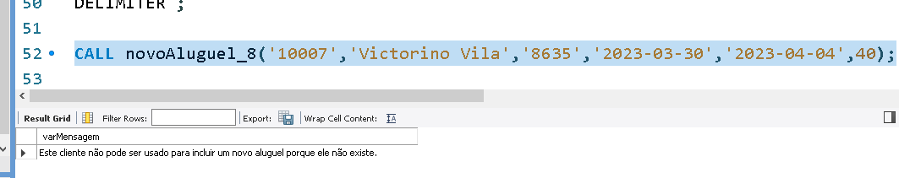

# Aprendendo o IF THEN ELSEIF
Vamos melhorar o nosso IF. Para isso, vamos criar um novo script e incluir um novo aluguel na linha 2. No entanto, a pessoa cliente será Victorino Vila, que não existe na tabela.

```sql
CALL novoAluguel_32('10007','Victorino Vila','8635','2023-03-30','2023-04-04',40);
```
Ao executar, veremos a mensagem "`Aluguel incluído na base com sucesso`". Como conseguimos incluir o aluguel, se essa pessoa não está no cadastro de clientes da Insight Places?

Para confirmar, vamos à linha 4 parar executar o seguinte comando:

```sql
SELECT * FROM clientes WHERE nome = 'Victorino Vila';
```

O resultado será uma tabela vazia. Então, o que aconteceu com o aluguel 1007?

Vamos verificar executando o seguinte comando na linha 5:

```sql
SELECT * FROM alugueis WHERE aluguel_id = 10007;
```
No retorno, veremos que ele foi incluído, mas o campo cliente_id está nulo.

    aluguel_id	cliente_id	hospedagem_id	data_inicio	data_fim	preco_total
    10007	    NULL	    8635	            2023-03-30	2023-04-04	200,00
Isso é um problema. Portanto, precisamos testar no nosso IF se a pessoa cliente existe.

Anteriormente, fizemos o seguinte teste: se o número de clientes for maior que 1, não incluímos e exibimos a mensagem de que aquela pessoa cliente não pode ser incluída, pois há mais de dois clientes com o mesmo nome.

No entanto, se o número de clientes for menor que 1, incluímos a pessoa cliente, mesmo que o número seja 0. Entretanto, se o número de clientes for 0, precisamos apresentar outra mensagem e não incluir a pessoa cliente.

## Utilizando o ELSEIF
Para continuar, vamos apagar o novo aluguel que conseguimos incluir, pois nossa Procedure não estava bem construída. Para isso, executaremos o seguinte comando na linha 6:
```SQL
DELETE FROM alugueis WHERE aluguel_id = '10007';
```

Agora, não temos mais aquele aluguel. Vamos copiar todo o bloco da Procedure construída no vídeo anterior e colá-la na guia atual, abaixo do DELETE FROM recém-executado, mantendo uma linha vazia entre eles.

Para evitar erros, vamos atualizar a Procedure para a versão 33.
```sql
USE `insightplaces`;
DROP procedure IF EXISTS `insightplaces`.`novoAluguel_33`;
DELIMITER $$
USE `insightplaces`$$
CREATE DEFINER=`root`@`localhost` PROCEDURE `novoAluguel_33`
(vAluguel VARCHAR(10), vClienteNome VARCHAR(150), vHospedagem VARCHAR(10), vDataInicio  DATE, vDataFinal DATE, vPrecoUnitario DECIMAL(10,2))
BEGIN
    DECLARE vCliente VARCHAR;
    DECLARE vDias INTEGER DEFAULT 0;
    DECLARE vNumCliente INTEGER;
    DECLARE vPrecoTotal DECIMAL(10,2);
    DECLARE vMensagem VARCHAR(100);
    DECLARE EXIT HANDLER FOR 1452
    BEGIN
        SET vMensagem = 'Problema de chave estrangeira associado a alguma entidade da base.';
        SELECT vMensagem;
    END;
    SET vNumCliente = (SELECT COUNT(*) FROM clientes WHERE nome = vClienteNome);
    IF vNumCliente > 1 THEN
        SET vMensagem = 'Este cliente não pode ser usado para incluir o aluguel pelo nome.';
        SELECT vMensagem;
    ELSE
        SET vDias = (SELECT DATEDIFF (vDataFinal, vDataInicio));
        SET vPrecoTotal = vDias * vPrecoUnitario;
        SELECT cliente_id FROM clientes WHERE nome = vClienteNome;
        INSERT INTO alugueis VALUES (vAluguel, vCliente, vHospedagem, vDataInicio, vDataFinal, vPrecoTotal);
        SET vMensagem = 'Aluguel incluído na base com sucesso.';
        SELECT vMensagem;
    END IF
END$$
DELIMITER ;
```
Na linha `IF vNumCliente > 1 THEN`, testamos se o número de clientes é maior do que 1. No entanto, também podemos ter dentro da estrutura IF o ELSEIF. Para isso, vamos adicionar em seu interior um ELSEIF vNumClient = 0 THEN, abaixo do SELECT vMensagem.

Dentro desse `ELSEIF`, vamos exibir a seguinte mensagem: "`Este cliente não pode ser usado para incluir o aluguel porque não existe`". Dessa forma, tratamos também o caso da pessoa cliente não existir.

Entretanto, se cairmos no ELSE seguinte, é porque a pessoa cliente existe e, portanto, será incluída.
```sql
-- Código omitido
    IF vNumCliente > 1 THEN
        SET vMensagem = 'Este cliente não pode ser usado para incluir o aluguel pelo nome.';
        SELECT vMensagem;
    ELSEIF vNumClient = 0 THEN
        SET vMensagem = 'Este cliente não pode ser usado para incluir o aluguel porque não existe.';
        SELECT vMensagem;
    ELSE
        SET vDias = (SELECT DATEDIFF (vDataFinal, vDataInicio));
        SET vPrecoTotal = vDias * vPrecoUnitario;
        SELECT cliente_id FROM clientes WHERE nome = vClienteNome;
        INSERT INTO alugueis VALUES (vAluguel, vCliente, vHospedagem, vDataInicio, vDataFinal, vPrecoTotal);
        SET vMensagem = 'Aluguel incluído na base com sucesso.';
        SELECT vMensagem;
    END IF
END$$
DELIMITER ;
```
Vamos salvar e executar toda essa Procedure, realizando um refresh em "Stored Procedures" na aba lateral esquerda para observar que a Procedure 8 foi criada.

    # Stored Procedures
    alo_mundo
    dataHora
    listaClientes
    novoAluguel_1
    novoAluguel_2
    novoAluguel_3
    novoAluguel_4
    novoAluguel_5
    novoAluguel_6
    novoAluguel_7
    novoAluguel_8
    tiposDados
Pularemos duas linhas a partir do último código do script e tentaremos incluir um novo aluguel do Victorino Vila com o mesmo código usado na linha 2, substituindo a versão da Procedure para 8.

```sql
CALL novoAluguel_33('10007','Victorino Vila','8635','2023-03-30','2023-04-04',40);
```
Após a execução, receberemos a mensagem "Esse cliente não pode ser usado para incluir aluguel porque não existe".



Portanto, nosso IF ficou melhor. Temos a estrutura do IF e ELSE e também a do IF, ELSEIF e ELSE.

A seguir, vamos reconstruir essa rotina, mas usando a estrutura do CASE.


## Question -  Aprimorando a validação de dados
 Próxima Atividade

Avançamos com a procedure de gerenciamento de alugueis com esta nova versão abaixo:

```sql
CREATE DEFINER=`root`@`localhost` PROCEDURE `novoAluguel_8`(vAluguel VARCHAR(10), vClienteNome VARCHAR(150), vHospedagem VARCHAR(10), vDataInicio DATE,
vDataFinal DATE, vPrecoUnitario DECIMAL(10,2))
BEGIN
    DECLARE vCliente VARCHAR(10);
    DECLARE vDias INTEGER DEFAULT 0;
    DECLARE vNumCliente INTEGER;
    DECLARE VPrecoTotal DECIMAL(10,2);
    DECLARE vMensagem VARCHAR(100);
    DECLARE EXIT HANDLER FOR 1452
    BEGIN
        SET vMensagem = 'Problema de chave estrangeira associado a alguma entidade da base.';
        SELECT vMensagem;
    END;
    SET vNumCliente = (SELECT COUNT(*) FROM clientes WHERE nome = vClienteNome);
    IF vNumCliente > 1 THEN
        SET vMensagem = 'Este cliente não pode ser usado para incluir o aluguel pelo nome.';
        SELECT vMensagem;
    ELSEIF vNumCliente = 0 THEN
        SET vMensagem = 'Este cliente não pode ser usado para incluir o aluguel porque não existe.';
        SELECT vMensagem;
    ELSE
        SET vDias = (SELECT DATEDIFF (vDataFinal, vDataInicio));
        SET vPrecoTotal = vDias * vPrecoUnitario;
        SELECT cliente_id INTO vCliente FROM clientes WHERE nome = vClienteNome;
        INSERT INTO alugueis VALUES (vAluguel, vCliente, vHospedagem, vDataInicio, 
        vDataFinal, vPrecoTotal);
        SET vMensagem = 'Aluguel incluido na base com sucesso.';
        SELECT vMensagem;
    END IF;
END
```

Na mais recente evolução das stored procedures da InsightPlaces para a inclusão de aluguéis, novoAluguel_8 introduz um avanço significativo ao empregar a estrutura IF-THEN-ELSEIF, melhorando a precisão na validação dos dados de entrada. Essa abordagem permite não apenas identificar múltiplas correspondências para um nome de cliente, mas também verificar a ausência total de correspondências, otimizando a lógica de decisão antes de proceder com a inserção dos dados de aluguel. Em contraste com as versões anteriores, qual é a principal inovação trazida pela inclusão do ELSEIF nesta procedure?


- (X) Oferece uma maneira de gerar mensagens de erro customizadas para condições de erro mais específicas.
>A introdução do ELSEIF permite a criação de mensagens de erro mais específicas e contextualizadas, dependendo do resultado da validação, seja por múltiplos registros encontrados ou nenhum registro correspondente.


- ( ) Habilita a execução de múltiplas inserções de dados em uma única operação, dependendo de condições específicas.


- ( ) Aumenta a segurança das transações de dados ao verificar a integridade dos registros antes da inserção.


- ( ) Permite a atualização de registros de clientes diretamente dentro da estrutura condicional.


- ( ) Introduz uma verificação de consistência dos dados da hospedagem antes de permitir a inserção de um novo aluguel.