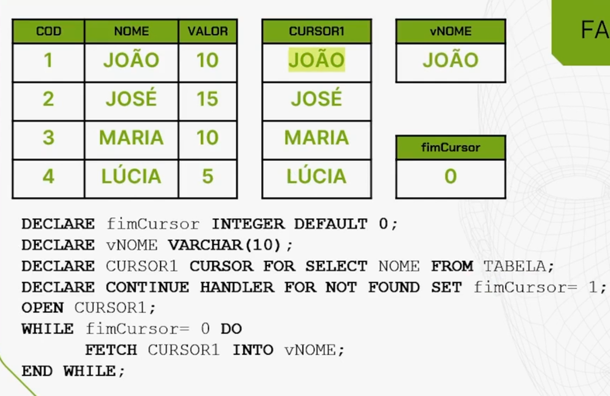

# Entendendo Cursor


Vamos entender agora o que é um CURSOR para, posteriormente, compreender como utilizá-lo para resolver o problema da Insight Places no caso de múltiplos clientes, ou seja, múltiplos aluguéis.

## O que é CURSOR

Em sua definição formal, o CURSOR é uma estrutura implementada no MySQL para permitir uma interatividade linha a linha através de uma determinada ordem.

Essa ordem é determinada por um comando SELECT, que define o CURSOR. Ou seja, realizamos um comando de consulta na base e o resultado desse comando é carregado em memória nessa variável que chamamos de CURSOR.

## Fases do CURSOR

 
Para utilizar o CURSOR, precisamos passar por algumas fases.

Primeiro, fazemos a declaração do CURSOR. Declaramos o CURSOR, damos um nome para ele e especificamos também na declaração a consulta SQL que estará associada a esse CURSOR.

Depois, é preciso fazer a abertura do CURSOR, ou seja, o habilitamos para ser usado. Ao abri-lo, automaticamente o ponteiro do CURSOR estará na posição 0. Quando falamos posição 0, não estamos nos referindo à primeira linha, mas sim ao início do CURSOR antes de percorrer cada linha do resultado dessa variável em memória.

Após abrir o CURSOR, percorremos linha a linha. Isto é, vamos para a primeira linha, descemos para a segunda linha, para a terceira linha e assim por diante até o final do CURSOR.

Quando chegamos no final do CURSOR, após usar as informações linha a linha, fechamos o CURSOR. Ao fechar o CURSOR, ele é limpo, a memória é limpa e a variável é descartada, no lixo interno da memória.

## Hora da prática
Vamos entender como isso funciona na prática. Suponhamos que temos a seguinte tabela:

    COD	NOME	VALOR
    1	JOÃO	10
    2	JOSÉ	15
    3	MARIA	10
    4	LÚCIA	5
Ela tem uma coluna com código (COD), uma com NOME e outra com VALOR.

Então, declaramos uma variável do tipo VARCHAR de 10 chamada vNOME.

```sql
DECLARE vNOME VARCHAR(10);
```

Para declarar o CURSOR, usamos `DECLARE` seguido do nome do `CURSOR`, colocamos a palavra `CURSOR FOR` e fazemos uma consulta SQL. Nesse caso, estamos consultando somente a coluna NOME da tabela de exemplo.

```sql
DECLARE CURSOR1 CURSOR FOR SELECT NOME FROM TABELA;
```

Ao fazer isso, abrimos o CURSOR com o comando OPEN.

```sql
OPEN CURSOR1;
```

Automaticamente, carregamos o resultado dessa consulta na variável de memória:

    CURSOR1
    JOÃO
    JOSÉ
    MARIA
    LÚCIA

Agora, percorremos linha a linha do CURSOR. Quando damos o comando FETCH seguido do nome do CURSOR INTO uma variável, simplesmente vamos à primeira posição do CURSOR, que no caso é JOÃO, e carregamos esse conteúdo nesta variável.

Se dermos um próximo comando FETCH, passamos para a segunda linha. Automaticamente, a variável que está associada ao FETCH recebe o conteúdo da segunda linha. Se dermos um terceiro FETCH, vamos para a terceira linha.
```sql
FETCH CURSOR1 INTO vNOME; --vNOME JOÃO
FETCH CURSOR1 INTO vNOME; --vNOME JOSÉ
FETCH CURSOR1 INTO vNOME; --vNOME MARIA
```
E, finalmente, se dermos um CLOSE, o CURSOR é limpo.

```sql
CLOSE CURSOR1;
Copiar código
CURSOR1
```


Demos três FETCH, mas poderíamos ter dado quatro, porque sabíamos que a variável CURSOR tinha quatro posições, que foi o resultado da nossa consulta.

Porém, como fazemos se não sabemos quantas posições tem um CURSOR e queremos percorrê-lo até o final?

Basta definir um CURSOR e um HANDLER, que força uma exceção que vai acontecer quando não existir mais posição no CURSOR.

Quando não encontrarmos mais ninguém no final do CURSOR, uma variável, que declaramos como 0 inicialmente, passa a ser 1. Nesse caso, chamamos essa variável de fimCursor.

```sql
DECLARE fimCursor INTEGER DEFAULT 0;
DECLARE vNOME VARCHAR(10);
DECLARE CURSOR1 CURSOR FOR SELECT NOME FROM TABELA;
DECLARE CONTINUE HANDLER FOR NOT FOUND SET fimCursor = 1;
```
Feito isso, abrimos o CURSOR.

Nesse momento, teremos o CURSOR todo preenchido, a variável vNOME ainda está vazia, porque ainda não demos nenhum FETCH, e fimCursor vale zero.

```sql
OPEN CURSOR1; --vNOME vazio, fimCursor 0
```
    CURSOR1
    JOÃO
    JOSÉ
    MARIA
    LÚCIA
E aí, construímos um WHILE, onde esse loop vai acontecer enquanto o fimCursor é igual a zero.

Enquanto isso, vamos dando o comando FETCH, jogando na variável vNOME, e fazemos de novo o loop. Ou seja, vamos percorrer todo o CURSOR.

Quando dermos um FETCH e o CURSOR estiver no seu final, o que vai acontecer? Automaticamente fimCursor passa a ser igual a 1 e saímos do loop.

```sql
WHILE fimCursor = 0 DO
    FETCH CURSOR1 INTO vNOME;
END WHILE;
```
Assim, ao dar a primeira volta do loop, realizamos o primeiro FETCH, que guarda JOÃO em vNome. A segunda volta do loop, gurda JOSÉ. A terceira volta do loop, guarda MARIA. A última volta do looping, guarda LÚCIA.

E quando demos o último FETCH, automaticamente fimCursor passa a ser igual a 1. Então, saímos do loop, e podemos dar o CLOSE do CURSOR.

```sql
CLOSE CURSOR1; --vNOME vazio, fimCursor 1
```
    CURSOR1
    -      
    -
    -
    -

É assim que percorremos um CURSOR baseado no conteúdo de uma tabela.


## Question -  Explorando o uso de cursores


Diante dos desafios de processar conjuntos de dados dentro de stored procedures, o conceito de cursores surge como uma ferramenta essencial para a gestão e operação de bancos de dados. Cursores, especialmente no contexto do SQL e, especificamente, dentro do MySQL, oferecem uma abordagem sistemática para iterar sobre linhas em um conjunto de resultados de uma instrução SELECT, permitindo o processamento linha a linha.

Considerando que essa técnica é particularmente útil em cenários onde operações precisam ser realizadas individualmente em cada registro, ou quando os dados precisam ser manipulados sequencialmente ao invés de em massa, o que acontece quando utilizamos um CURSOR em uma stored procedure no MySQL?

Selecione uma alternativa

- ( ) O CURSOR permite modificar a estrutura da tabela enquanto percorre cada linha.


- (X) O CURSOR é aberto, percorre linha a linha os registros selecionados e é fechado ao final, liberando recursos.


- ( ) Um CURSOR executa um comando DELETE para cada linha que não atende a uma condição específica.


- ( ) CURSORES são usados para inserir dados em massa a partir de uma única instrução SELECT.


- ( ) O CURSOR automaticamente atualiza registros na tabela baseado no comando SELECT associado.
