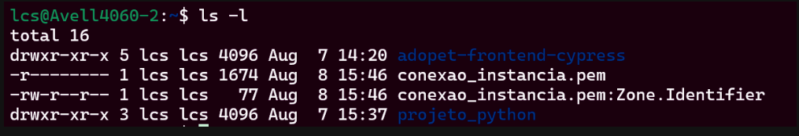

# Entendendo as permissões no Linux

No Linux, quando um arquivo ou diretório é criado, algumas permissões são atribuídas a ele de forma automática.

As permissões são divididas em três grupos: o usuário que criou o arquivo (usuário proprietário), o grupo dono do arquivo (que pode conter vários usuários) e os demais usuários que não pertencem ao grupo dono.

Essas permissões podem ser de três tipos:

1. **Leitura (r,** read): para visualizar o conteúdo de um arquivo ou diretório.

2. **Escrita (w, write)**: para alterar o conteúdo de um arquivo e diretório.

3. **Execução (x, execute)**: para tornar o arquivo um executável, ou, no caso de um diretório, ser possível acessá-lo e usar comandos, como o cd.

Para visualizar a permissão de um diretório, podemos ir até o local onde esse diretório se encontra utilizando o comando cd. Então, podemos listar os arquivos e suas permissões utilizando ls com a opção -l. Assim, obteremos informações detalhadas sobre cada item armazenado no diretório. As permissões estão listadas na primeira coluna do resultado exibido.

Essa primeira coluna é dividida em dez caracteres. O primeiro nos mostra se o objeto listado é um arquivo (-) ou um diretório (d). Os nove caracteres restantes indicam as permissões do usuário dono, grupo dono e outros usuários respectivamente. Caso tenha alguma permissão, é mostrado a letra correspondente a permissão, senão um traço (-) é apresentado.